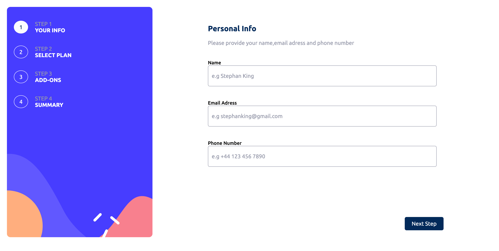

# Multi-Step Form Web Application

Multi-Step Form is a React-based web application that offers a seamless user experience for collecting user information and choices across multiple steps.

## Screenshot

## Live Site

[Multi-Step Form Live Site](https://multi-step-form-wvzz.onrender.com/)

## Features

### Dynamic Form Progression

The application guides users through a series of steps, dynamically updating the form based on user input. This ensures a smooth and intuitive experience as users progress through each step.

### User Validation

Validation is implemented at each step to ensure the accuracy and completeness of user-provided information.

### Flexible Billing Options

Users are provided with flexible billing options, including both monthly and yearly plans. The application seamlessly switches between billing frequencies based on user preferences, demonstrating dynamic content rendering.

### Addon Selection

Users have the option to select additional features or addons to enhance their chosen plan. This feature showcases the application's ability to manage complex user choices and preferences across multiple steps.

## Tech Stack

- **React**: Used for building a responsive and interactive user interface, showcasing proficiency in front-end development with React.
- **HTML5 & CSS3 with SASS**: Utilized for structuring web pages and styling the application's user interface. Demonstrates expertise in modern web development techniques for creating visually appealing designs.
- **JavaScript (ES6)**: Implemented for interactivity and dynamic behavior, including form validation and navigation. Highlights proficiency in modern JavaScript programming and ES6 features.
- **React Context API**: Utilized for managing user choices and state across multiple components, demonstrating proficiency in state management with React.

## Credits

- **Frontend Mentor**: Provided design assets and challenges for practicing front-end development skills.
